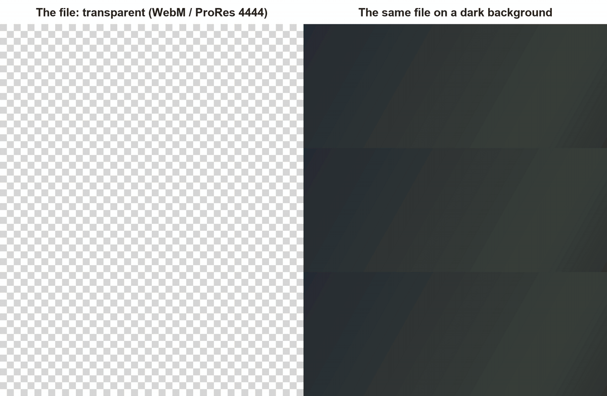

# Lower Thirds Skills

> Animated lower thirds with a real transparent background, made by your AI coding agent from one sentence. Every frame is drawn in JavaScript on a canvas and rendered to **WebM with alpha** for OBS, or **ProRes 4444** for Premiere Pro, DaVinci Resolve and Final Cut. No After Effects, no templates, no green screen.



*Three [examples](./examples), each made by a fresh agent from a one-line request with no human edits. Left: the exported file is see-through. Right: the same file on a dark background.*

## Install

```bash
npx skills add iart-ai/lower-thirds-skills
```

Or add it as a Claude Code plugin marketplace:

```bash
/plugin marketplace add iart-ai/lower-thirds-skills
```

then `/plugin install lower-thirds-skills`.

## Ask for one

- "Lower thirds for my podcast Off the Record: me (Maya Chen, Host) and my guest Daniel Ortiz, Founder, Northwind. I edit in Premiere."
- "An animated name card for my Twitch stream, I'm PixelPilot, speedrunning Hollow Knight. Neon. I use OBS."
- "A lower third for Pastor Grace Owens, sermon series 'Rooted', and one for the scripture reading. Warm and elegant."

The agent designs the graphic for your show (not from a template library), checks it, and hands you one file per person.

## What you get

| You use | You get |
|---|---|
| OBS Studio | `.webm` (VP9 with alpha) for a Media Source, or the page itself as a Browser Source, so you can change a name without re-rendering |
| Premiere Pro, DaVinci Resolve, Final Cut Pro | `.mov` (ProRes 4444 with alpha) |
| A web page | `.webm` for Chrome and Edge, plus an HEVC-with-alpha copy for Safari (made on macOS) |
| An editor without alpha support | `.mp4` on a green ground for chroma key |

Plus the HTML page it was drawn from: change the names in `CARDS` and render again, or render the same design at 3840×2160 with `--scale 2`. Setup steps for each tool are in [delivery.md](./skills/lower-thirds/references/delivery.md).

## How it checks its own work

A transparent graphic has failure modes you can't see until it's over footage, so the agent checks before you do:

- `--check` fails the design if anything paints a background (the file wouldn't be see-through), if the first or last frame isn't empty (it would pop on or cut off in your edit), if any pixel leaves the title-safe area, or if a font face (family, weight, italic) did not load.
- Stills of the hold over a checkerboard, a dark and a light background, so every word is judged against both.
- Contact sheets of the build-in and build-out, cropped to the graphic and enlarged, frame by frame.
- After encoding, the script decodes a frame of the WebM or ProRes file and confirms it really comes back see-through.

## What's included

| Path | What it is |
|---|---|
| [skills/lower-thirds/SKILL.md](./skills/lower-thirds/SKILL.md) | The workflow: read the brief, design for the show, check, render, deliver |
| [templates/lower-third.html](./skills/lower-thirds/templates/lower-third.html) | A transparent canvas page: timing (in, still hold, out, empty ends), title-safe margin, text fitting, font loading, several cards per design, preview grounds, OBS mode |
| [scripts/render.mjs](./skills/lower-thirds/scripts/render.mjs) | WebM with alpha, ProRes 4444, green-screen MP4, stills, contact sheets, `--check` |
| [references/delivery.md](./skills/lower-thirds/references/delivery.md) | OBS, Premiere, Resolve, Final Cut, web |

## Which model

Built and tested with **Claude Opus 5.5**. The design and the self-check lean on a model that can **look at images**: it reviews its own stills and contact sheets. Other models have not been tested with this pack.

## Requirements

Node 18+, `npm i playwright-core`, ffmpeg (with libvpx-vp9 and prores_ks, which standard builds include), and Chrome (or `npx playwright install chromium`). No API keys.

Working from a clone instead of an installed skill: run `npm i playwright-core` in the repo root; the scripts find it from any folder inside, such as `examples/podcast/` or a `work/` folder of your own.

## Topics

`lower-thirds` `transparent-video` `alpha-channel` `obs` `stream-overlay` `webm` `prores-4444` `claude-skill`

## More packs

Part of the open-source motion skills collection. Full hub: **[github.com/iart-ai/motion-skills](https://github.com/iart-ai/motion-skills)**

## License

MIT

---

Built by **[iart.ai](https://iart.ai/lower-thirds?utm_source=github&utm_medium=readme&utm_campaign=lower-thirds-skills&utm_content=footer)**, the AI motion agent. Rather not run code? Describe your lower third at [iart.ai/lower-thirds](https://iart.ai/lower-thirds?utm_source=github&utm_medium=readme&utm_campaign=lower-thirds-skills&utm_content=no-code) and export it as a transparent WebM (export is on paid plans).
